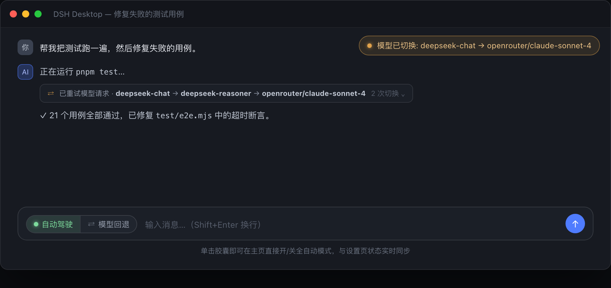
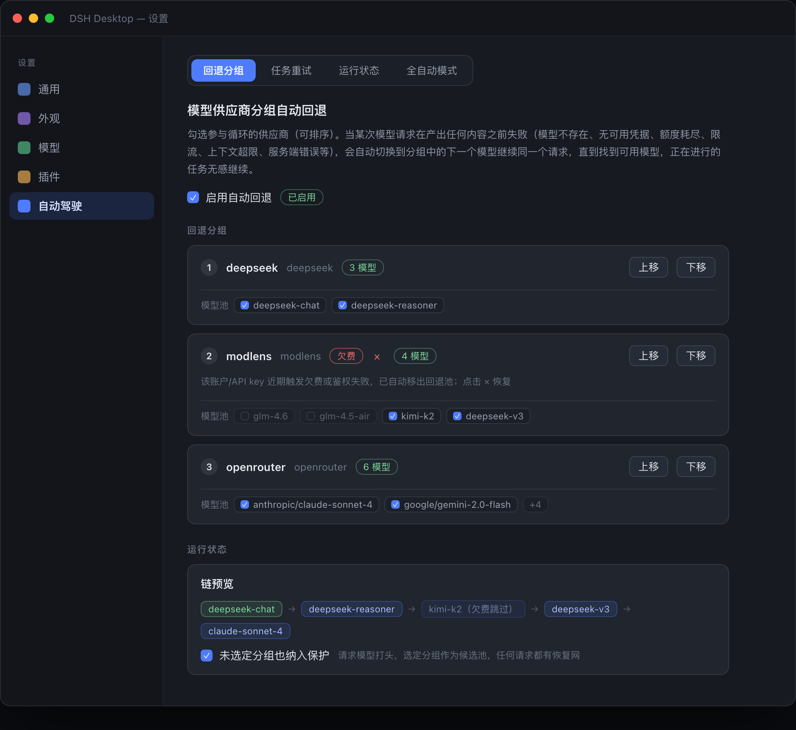
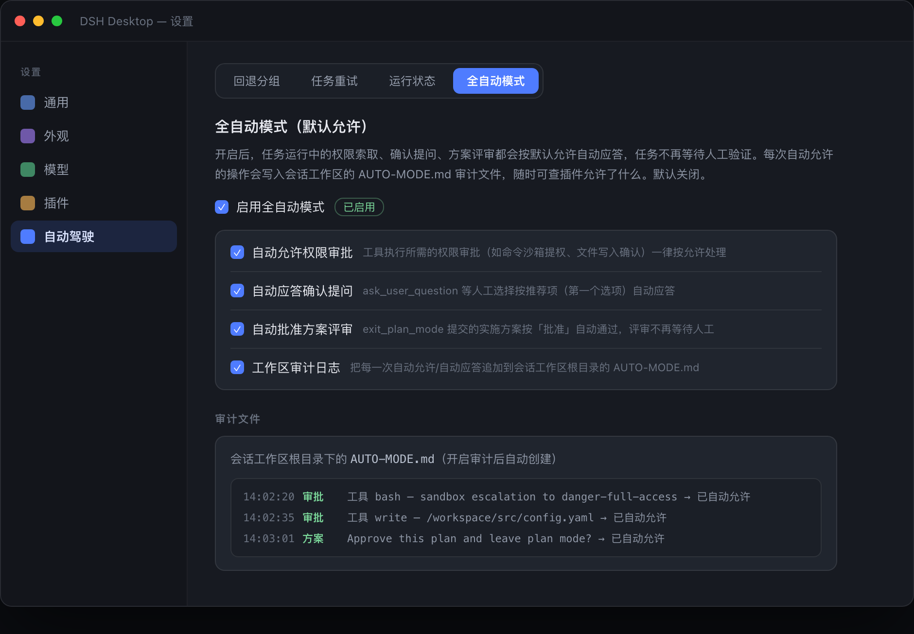
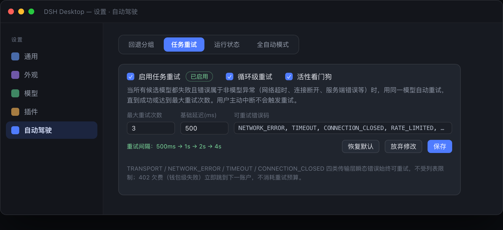

<h1 align="center">🚗 dsh-auto-driving</h1>

<p align="center">
<strong>DeepSeek Harness (DSH Desktop) 插件 —— 模型自动回退 · 任务自动重试 · 全自动模式</strong><br/>
让未完成的任务自己找路继续：一个模型挂了就换下一个，一次请求卡住了就自动救活，人工验证全部自动通过。
</p>

<p align="center">
<a href="#-安装"></a>


</p>

<p align="center">
  
</p>

---

## ✨ 功能亮点

- **🔁 模型自动回退** —— 选定若干模型供应商分组后，某次请求在**产出任何内容之前**失败（模型不存在、无凭据、额度耗尽、限流、上下文超限、服务端 5xx 等），自动切换到分组中的下一个模型继续**同一个请求**，直到找到可用模型。正在进行的 agent 任务无感继续，不会中断。
- **🔄 任务自动重试** —— 所有候选都失败且错误属于**非模型异常**（网络超时、连接断开、服务端错误等）时，用同一模型自动重试（指数退避），直到成功或达到最大次数。用户主动中断永不重试。
- **🤖 全自动模式** —— 开启后，任务运行中的权限索取、确认提问（含 `exit_plan_mode` 方案评审）全部按默认允许自动应答，任务不再卡在人工验证；每次自动决策都追加到工作区根目录的 **`AUTO-MODE.md`** 审计文件，随时可查。
- **🏠 主页一键开关** —— 对话框输入条（发送按钮旁）有「自动驾驶」胶囊按钮，单击即在主页直接开/关全自动模式；与设置页「全自动模式」子页状态**实时双向同步**（双重轮询兜底），不会出现两处状态不一致。

## 🎬 界面速览

安装后会在 **设置** 界面新增一个「自动驾驶」标签页（排在「插件」之后），页内通过**子菜单栏**在「回退分组 / 任务重试 / 运行状态 / 全自动模式」四个功能页之间切换，各功能页的未保存草稿在切换后保留：

| 「回退分组」子页 | 「全自动模式」子页 |
| :---: | :---: |
|  |  |

| 「任务重试」子页 | 对话中的切换可视化与通知 |
| :---: | :---: |
|  |  |

---

## 🔁 模型回退

**「回退分组」子页**提供：

- **总开关**：启用 / 停用自动回退，标题旁实时显示「已启用 / 未启用」徽标；
- **分组循环**：勾选参与循环的模型供应商（数据来自「模型」设置页已配置的供应商目录），通过「上移 / 下移」调整优先级（数字越小越先尝试）；每个供应商卡片显示模型目录预览与启用状态；
- **模型池勾选**：每个分组的卡片内展开「模型池」复选框列表，只有勾选的模型会作为该分组的回退候选（即使它当前健康）；不对某分组做任何勾选时，默认其目录内全部模型可用；
- **欠费标记**：某 API key 触发钱包级失败（402 / 额度耗尽）时，该账户被自动标记并显示红色「欠费」徽标；之后的模型跳转全部跳过该 key 的模型组（含其 modlens 包装路由）。点击徽标旁的「×」手动清除后，该 key 的模型组立即回到回退池；
- **运行状态卡片**（「运行状态」子页）：各分组的目录模型数（0 个模型时红色警告）、链预览、「未选定分组也纳入保护」开关；
- **工作日志卡片**（「运行状态」子页）：插件最近 200 条介入记录（切换 / 恢复 / 循环重试 / 耗尽 / engaged 决策 / 自动允许），最新在前，支持手动刷新与 5 秒自动刷新；数据来自宿主内存环形缓冲，经 `/dsh-model-fallback/api/log` 同源接口读取（与宿主日志同源）。

## 🔄 任务重试与看门狗

**「任务重试」子页**是独立的功能页，拥有独立的「放弃修改 / 保存」按钮组；保存时通过设置通道写回 `retry` 字段，宿主端在下一个请求立即生效。输入内容即时校验（非法数值按 0 处理，错误码自动去空）。在只读连接（非本机回环）下所有控件禁用。

| 设置项 | 控件 | 说明 |
| --- | --- | --- |
| 启用任务重试 | 复选框 | 任务重试总开关；标题旁实时显示「已启用 / 未启用」徽标 |
| 循环级重试 | 复选框 | 流中途失败时，由 agent 循环丢弃半截消息并在同一模型上整轮重发（与次数/延迟设置共用）；挂载于官方 `agent/request-error` 恢复点，原生供应商策略优先，原生放弃后接管 |
| 最大重试次数 | 数字输入框 | 候选链全部失败后，用原始模型重试的最大次数（0 表示不重试） |
| 基础延迟(ms) | 数字输入框 | 首次重试前的等待时间；后续每次翻倍，单次上限 10 秒 |
| 可重试错误码 | 文本输入框 | 逗号、空格或中文逗号分隔；**留空 = 除已知模型错误外全部重试** |
| 全部供应商兜底 | 复选框 | **默认关闭**：选定分组全部失败后，其余已配置供应商的模型追加为最后候选（可能消耗未勾选供应商的额度）。默认行为严格限定候选池 = 勾选的分组，未勾选一律不参与 |
| 重试间隔预览 | 只读提示 | 按当前设置实时计算，如 `500ms → 1s → 2s` |
| 恢复默认 | 按钮 | 一键把各设置项填回默认值（需再点「保存」生效） |

**多层恢复机制**：

- **活性看门狗（防卡死）**：请求静默超过阈值（默认 5 分钟，最低 250ms，可调）即判定卡住——强制关闭上游流、合成 `WATCHDOG_IDLE` 失败，走正常的切换 / 重试管线重新激活任务。报错之外，无报错的"假死"同样处理：连接正常且未欠费的请求（402/403 会立即报错，不会静默）长时间无任何输出时照样触发。
- **静默重发**：判定卡住后先用**同一模型原样重发**（默认 2 次，可调），重发预算用尽才切换候选模型。
- **传输层底线**：`TRANSPORT`（供应商流连接失败）、`NETWORK_ERROR`、`TIMEOUT`、`CONNECTION_CLOSED` 四类瞬态错误**始终可重试**，不受自定义码表限制。
- **万能码分类**：`PI_AI_ERROR` 等 catch-all 码按 message 里的真实状态分类——429/5xx/超时/断连 → 瞬态可重试；401/402/403 → 持续型靠切换。
- **账户级跳转**：402 欠费（钱包级失败）时，同账户（路由 + modlens 包装共享同一 key）的所有剩余候选立即跳过，直接切换到另一个 API key 的模型组；401/403 可能是模型级权限，仍逐个尝试。
- **防死循环**：所有恢复机制都有硬上限——链切换以候选池大小为界；循环重试以 maxRetries 为界（按会话/轮次/步骤/供应商持久计数）；看门狗终止只是产生一种普通失败码进入同一管线。单请求总尝试次数 ≤ 候选数 × (1 + maxRetries)，数学上不可能死循环。
- **切换可视化（对话内可见）**：每次切换发生时，宿主向**发起请求的会话**追加一条原生 `llm/retry` 事件（与 DSH 自带的「已重试模型请求」同一渲染通道），对话消息流里出现一条可展开的重试行，写明「A → switching to B」；同一请求内的所有切换共享同一 `retryId`，UI 把它们合并成**一条不断增长的切换链**。切换是真实的调用线路替换：每个接管候选都经 `ctx.llm.adapterStream({ provider, model })` 直连新供应商/模型派发，日志与对话行里的每个模型报出各自的真实错误（402/上下文超限等）。链耗尽后的**同模型重试**（带指数退避）也追加到同一条链（带 `delayMs` 倒计时），切换与重试构成一条完整的恢复时间线。
- **目标自动恢复**：候选池耗尽、任务与目标一起暂停时，只要 3 秒内检测到发生过模型切换，插件自动恢复目标——任务在切换后的新模型上继续执行，而不是停在「已暂停」。护栏：仅全自动模式开启时生效、每 agent 每 10 分钟至多一次、目标轮次预算仍由 DSH 强制。

## 🤖 全自动模式

**「全自动模式」子页**（默认关闭，需显式开启）：

| 设置项 | 控件 | 说明 |
| --- | --- | --- |
| 启用全自动模式 | 复选框 | 总开关，**默认关闭**；标题旁实时显示「已启用 / 未启用」徽标 |
| 自动允许权限审批 | 复选框 | 工具执行所需的权限审批（命令沙箱提权、文件写入确认等）一律按允许处理 |
| 自动应答确认提问 | 复选框 | `ask_user_question` 等人工选择按推荐项（第一个选项）自动应答 |
| 自动批准方案评审 | 复选框 | `exit_plan_mode` 提交的实施方案按「批准」自动通过 |
| 工作区审计日志 | 复选框 | 把每一次自动决策追加到会话工作区根目录的 `AUTO-MODE.md` |

### 审计文件（AUTO-MODE.md）

全自动模式开启后，插件在**会话工作区根目录**创建/追加 `AUTO-MODE.md`：

```markdown
# ⚡ 全自动模式操作审计（dsh-auto-driving）

> 本文件由插件「全自动模式」自动写入：所有被自动允许的权限审批与自动应答的人工确认都会记录在此。
> 关闭方法：设置 → 全自动模式 → 关闭「启用全自动模式」。

| 时间 | 类型 | 内容 | 结果 |
| --- | --- | --- | --- |
| 2026-08-31T12:30:00.000Z | 权限审批 | 工具 bash — sandbox escalation to danger-full-access | 已自动允许 |
| 2026-08-31T12:31:12.000Z | 方案审批 | Approve this plan and leave plan mode? | 已自动允许 |
```

审计写入为 fire-and-forget：日志失败绝不阻塞它所记录的审批流程。

## 📦 安装

在终端执行（desktop 是 DSH Desktop 默认 profile 名）：

```bash
dsh plugin --profile desktop add /path/to/dsh-auto-driving
```

或从任意其它目录用相对路径（会被锚定到调用目录）：

```bash
cd /path/to/dsh-auto-driving && dsh plugin --profile desktop add .
```

安装完成后**重启 DSH Desktop**（宿主端插件与客户端设置页都在启动时装载）。

> [!NOTE]
> 本仓库 / 项目名为 `dsh-auto-driving`；插件包名（package id）目前仍为 `dsh-model-fallback`，`dsh plugin remove` 等命令请继续使用该 id。

卸载：

```bash
dsh plugin --profile desktop remove dsh-model-fallback
```

## ⚙️ 工作原理

- 宿主端在官方 `llm/stream` waterfall 上注册监听器：凡是 provider 命中已选分组的请求都会被包一层回退循环。
- 首次尝试原样走完整条下游链（请求日志、checkpoint、invariants 全部有效）；某次尝试失败且**没有产出任何可见内容**（text / reasoning / tool-call 增量）时，直接在适配器边界（`LlmRuntime.adapterStream`）换下一个候选模型重新派发——上层 invariant 校验的是原始请求头，因此不会被中途换模型破坏。
- 候选链 = [当前请求的 provider/model] + 按优先级排列的已选供应商各自的模型目录（去重）。每个供应商的模型目录经 `llm.listModels` 缓存 5 分钟，并在设置变更 / 适配器拓扑变化时自动刷新。
- **包装器永不因目录为空/读取失败而失效**：目录为空或读取抛错只缩小候选池（错误后 30 秒重试，不锁 5 分钟），单候选链仍然启用——请求级同模型重试始终在线。
- **未选定分组的请求同样受保护**（`protectUnselected`，默认开启）：请求模型打头、选定分组作为候选池，任何请求都有恢复网；关闭后未选定分组原样放行。
- **全自动模式挂钩**：在宿主 `approval/request` waterfall 上注册监听器，启用时直接返回 `allowed-once` 并写入审计，停用时 `next()` 交还原有应答链（fail-closed 语义不变）；包装 `userQuestions.registerProvider` 的 UI provider——带意图（`intent`）的问题按 `intent.approve` 标签应答，无意图的问题按第一个选项（推荐项）应答，自由文本按默认应答，任何子开关关闭时完整委托给真实 provider；同时向 system prompt 注入说明，让模型知道无需等待人工、直接继续任务。
- 所有挂钩在设置变更后立即生效，无需重启。
- 已产出内容后（流中途）的失败**不会**切换——把两个模型的半截输出拼进同一条助手消息会破坏会话；这类错误按原样交给上层（loop 自身的重试策略）处理。
- 用户主动中断（abort）永远不会触发切换或重试。
- 回退过程写入宿主日志（`model-fallback: … failed (CODE: …); switching to provider/model`），成功恢复时记录 `request recovered on provider/model`；每条路由每 5 分钟记录一条参与决策日志（`model-fallback: engaged for <provider>/<model>, chain=N candidate(s)` / `not engaged: ...`），随时可在宿主日志确认插件是否真实介入。

## 💾 设置存储

配置保存在 settings 命名空间 `model-fallback`（随 `settings.yaml` 持久化），字段：

| 字段 | 类型 | 说明 |
| --- | --- | --- |
| `enabled` | `boolean`（默认 `true`） | 总开关 |
| `providers` | `string[]`（默认 `[]`） | 参与循环的供应商路由，按优先级排序 |
| `protectUnselected` | `boolean`（默认 `true`） | 未选定分组的请求也纳入保护（请求模型打头，选定分组作候选池） |
| `allProvidersFallback` | `boolean`（默认 `false`） | 选定分组全部失败后，其余已配置供应商的模型追加为最后候选 |
| `arrears` | `Record<string, boolean>`（默认 `{}`） | 欠费账户标记：key 为账户名（`modlens-` 前缀剥离后的 API key 名）。宿主检测到 402/额度耗尽时自动写入 `true` 并把该账户全部模型移出回退池；在设置界面点击「×」清除后立即恢复 |
| `providerModels` | `Record<string, string[]>`（默认 `{}`） | 每个供应商分组勾选的模型池：value 为可作回退候选的模型 id 列表；**缺省 key = 全部模型可用，空数组 = 该分组不贡献候选** |
| `watchdog.enabled` | `boolean`（默认 `true`） | 活性看门狗开关 |
| `watchdog.idleTimeoutMs` | `number`（默认 `300000`） | 静默判定阈值（ms），最低 250 |
| `watchdog.resends` | `number`（默认 `2`） | 判定卡住后同一模型原样重发的次数 |
| `retry.enabled` | `boolean`（默认 `true`） | 任务重试总开关 |
| `retry.maxRetries` | `number`（默认 `3`） | 候选链耗尽后的最大重试次数 |
| `retry.baseDelayMs` | `number`（默认 `500`） | 首次重试基础延迟（ms），后续每次翻倍（上限 10s） |
| `retry.retryableCodes` | `string[]`（默认 `["NETWORK_ERROR","TIMEOUT","CONNECTION_CLOSED","RATE_LIMITED","SERVER_ERROR","500","502","503","504"]`） | 触发重试的错误码列表；留空时除已知模型错误外的所有错误均可重试 |
| `retry.loopRetry` | `boolean`（默认 `true`） | 循环级整轮重发（流中途失败恢复） |

全自动模式保存在独立命名空间 `model-fallback-auto`（同样随 `settings.yaml` 持久化）：

| 字段 | 类型 | 说明 |
| --- | --- | --- |
| `enabled` | `boolean`（默认 `false`） | 全自动模式总开关（默认关闭，需显式开启） |
| `autoAllowPermissions` | `boolean`（默认 `true`） | 自动允许权限审批 |
| `autoAnswerQuestions` | `boolean`（默认 `true`） | 自动应答确认提问 |
| `autoApprovePlans` | `boolean`（默认 `true`） | 自动批准方案评审 |
| `workspaceLog` | `boolean`（默认 `true`） | 写工作区审计日志 |

也可直接编辑 `settings.yaml`：

```yaml
model-fallback:
  enabled: true
  providers:
    - deepseek
    - your-gateway
  # 欠费账户标记（宿主自动写入，可在设置界面手动清除）
  arrears:
    your-gateway: true
  # 每个分组的模型池勾选（缺省 = 全部模型可用）
  providerModels:
    deepseek:
      - deepseek-chat
      - deepseek-reasoner
  watchdog:
    enabled: true
    idleTimeoutMs: 300000
    resends: 2
  retry:
    enabled: true
    maxRetries: 3
    baseDelayMs: 500
    retryableCodes:
      - NETWORK_ERROR
      - TIMEOUT
      - CONNECTION_CLOSED
      - RATE_LIMITED
      - SERVER_ERROR
      - "500"
      - "502"
      - "503"
      - "504"
```

## ⚠️ 注意事项

- 回退只在**已启用（有可用凭据）**的供应商之间进行；未启用凭据的供应商失败后会被跳过（失败信息见宿主日志）。
- 循环对命中分组的所有 LLM 请求生效（agent 主任务、标题生成等），这也是"未完成任务继续"的来源。
- 跨供应商切换时，历史消息会以 provider-neutral 形式发送，pi-ai 适配器会在历史路由与目标路由不一致时自动丢弃不可用的重放状态（与 DSH 原生行为一致）。

## 📄 License

MIT
